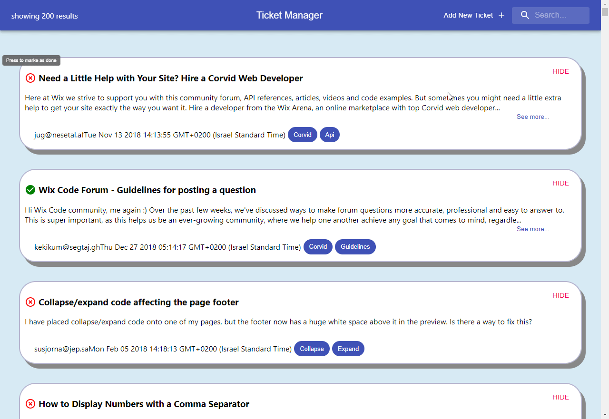
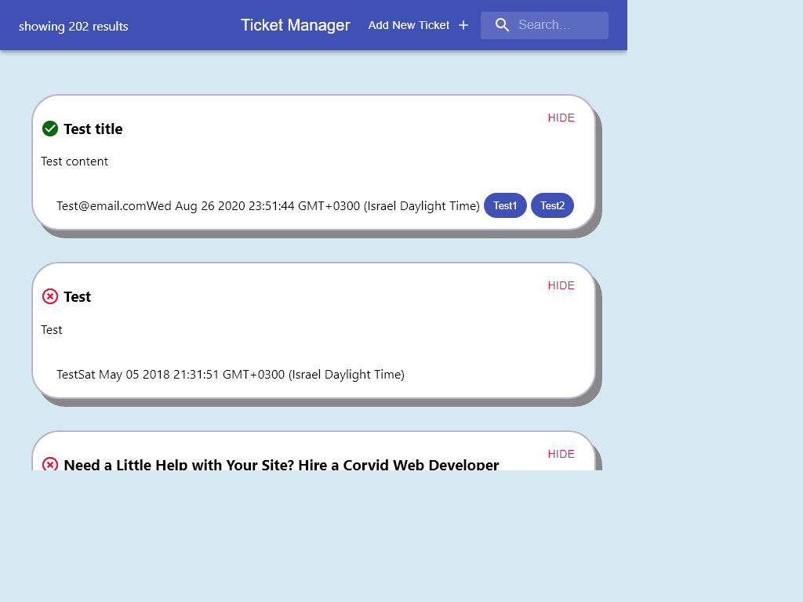

#    Final 1/5 - Tickets Manager

This is my Ticket Manager app!
The app passes all tests and requirements, and also has some bonus features and tetsts.

Bonuses:
- The 'Add New Ticket' button allows you to add a new ticket to the data base using a new end point in the sever.
- Every ticket has a done and undone icon in the top left corner. If the icon is clicked, it changes the tickets 'done' value in the server, and also changes the icon in client.
- all the new features are supported by tests, both in the frontend and in the backend.

glitch link:
https://david35008-ticket-manager-glitch.glitch.me/

my gif:

your gif:

